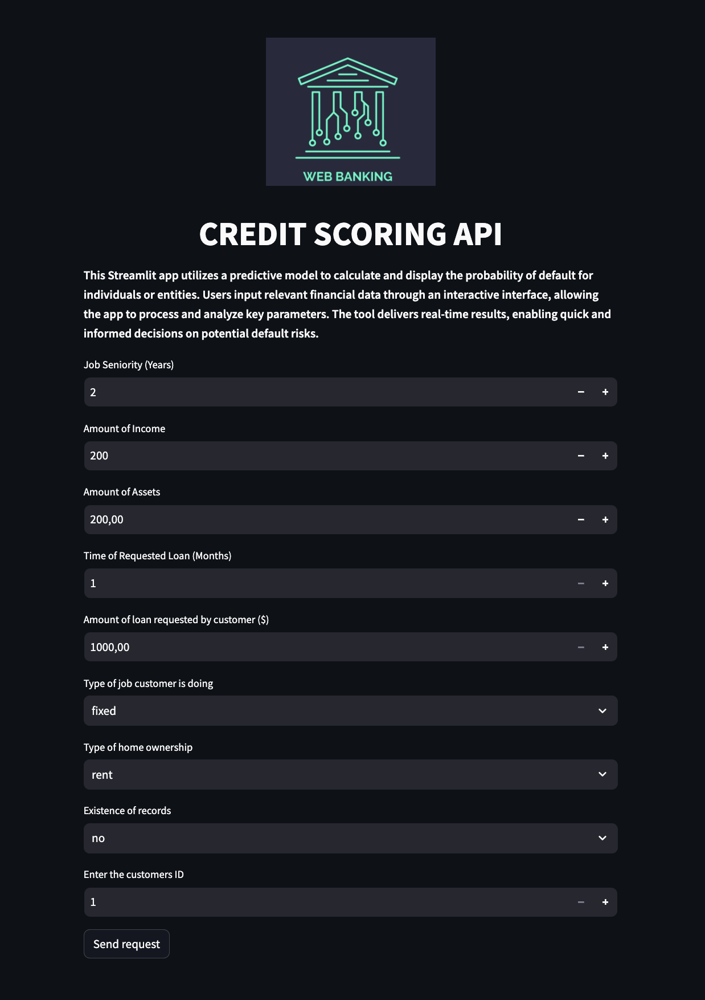

# Credit Scoring Web App


<p align="center">
  
</p>


Credit scoring predicts whether a borrower is likely to default on a loan by analyzing factors like credit history, payment patterns, debt levels, and financial behavior.
It serves in aiding lenders making informed decisions about extending credit.

Defaulting on a loan in simple terms means not doing what you promised to do when you borrowed money. When you take out a loan, you agree to certain terms like making regular payments on time. If you fail to make those payments as agreed, it's called defaulting.

Imagine you borrowed money to buy a bicycle, and you promised to pay back a certain amount every month. If you miss a few payments or stop paying altogether, you are in default. It's like breaking a promise to the person or institution that lent you the money.

Defaulting on a loan can have consequences. It can hurt your credit score, which is like a report card of how trustworthy you are with money. It might also lead to extra fees, and in some cases, the lender could take legal action to get back the money you owe.

So, defaulting is essentially not keeping your end of the deal when it comes to repaying money you borrowed. It's important to communicate with your lender if you're having trouble making payments to explore possible solutions and avoid defaulting.

<!-- TABLE OF CONTENTS -->

## Table of Contents

* [Introduction](#Introduction)
* [Definitions](#Definitions)
* [Getting Started](#Getting-Started)
    * [Prerequisites](#Prerequisites)
    * [Installation](#Installation)
* [Deployment to AWS Beanstalk](#deploy-containerized-fastapi-endpoint-or-streamlit-app-to-aws-beanstalk)

## Introduction
This project focuses on predicting the probability if the customer will 'default' or not. It is a binary classification problem, but it also exposes probabilities of defaulting such that lender has high overview of the decision. The model is trained using `XGBoost`, hyper-parameters are tuned by using `MLFlow` on top of `hyperopt` from which the best run is selected as the 'ideal' model.

Having an end-user in mind, a simple Web UI using `Streamlit` is made from which users can operate by tweaking parameters directly, sending the request to `FastAPI` endpoint (which uses a pre-trained `XGBoost` model) and receiving the JSON response in terms of probability of defaulting and the ground truth based on that probability.

`Python 3.12` is used for it's intuitive type-hinting, but note for example that `awsebcli` works only for versons of Python that are `<=3.11`, at least at the moment of writting this. 

Also note that FastAPI endpoint is made to be concurrent using `asyncio`, `await/async` syntax and `httpx` library that supports sending concurrent HTTP requests.
`Streamlit` app doesn't support concurrent programming (?), and hence it is made to be solely for demonstrative purposes.


Both the FastAPI endpoint and Streamlit Web UI are containerized using `Docker` as separate entities and also by using `docker-compose`.
Thus, separate directories are introduced to manage them effectively. Both entities are first tested locally and then deployed via `AWS Elastic Beanstalk`.

On top of all this, the simple `CI/CD` pipeline is introduced by using `GitHub Actions`. Depending on branching strategy one uses workflows could be changed
accordingly:

1) `style-check-fastapi.yml` and `style-check-streamlit.yml` are used for testing FastAPI endpoint and Streamlit app respectively. It checks if the code is properly formated using `black` and `flake8` for style-guide enforcement.
2) `deploy-fastapi.yml` and `deploy-streamlit.yml` are  used for deploying FastAPI endpoint and Streamlit app to AWS Elastic Beanstalk respectively,
3) `style-check-all.yml` tests the `docker-compose` version introduced in `01-docker-image`.  

**Note:** *Ensure that they work for the current directory structure; therefore, make sure to fix that. Additionally, adjust your AWS credentials appropriately.*

All of them are tested by creating GitHub Actions workflows, and it is up to one to decide on which branch they want them to be triggered.
It is designed on the basis of 'the separation of concerns', expecting that each service is easier to develop, test and deploy when it is it's own entity,
and the communication between them can be made either if they are both deployed localy, if one of them being deployed to `AWS Elastic Beanstalk` or both being deployed to `AWS`.

It might be a bit cumbersome at first when you deploy them both on `AWS` because they are "tightly related in code", but once you obtain URL for `FastAPI` endpoint you need to  `ssh` into the `EC2` instance made by deploying Streamlit app on `AWS Elastic Beanstalk` and change the code accordingly.  

**Note:** *Don't forget to terminate instances once they are deployed and you've checked that everything works!*


### Definitions
Dataset used in this project is sourced from [this repository](https://github.com/gastonstat/CreditScoring). For detailed information about the dataset, please refer to the same repo.

If you are interested in the exploratory data analysis (EDA) portion and the decisions made in choosing features, feature engineering, and training the model, you can find the relevant details in this [Jupyter Notebook](https://github.com/lobvh/ml-refresher/blob/week_6_mlflow/week-6/credit-risk-scoring-with-eda.ipynb).


## Getting Started

### Prerequisites

- Python
  
    ```Python 3.12.0```
  
    ```Python <=3.11.0``` --> Only if your method of deployment is using `awsebcli`. 

- Docker Desktop

### Installation

The bare necessity is to be comfortable with using pipenv or any dependency management tool, and creating a fresh new environment so that it doesn't interfere with your stable environment.
I've used `pipenv` mainly for generating `Pipfile` and `Pipfile.lock` such that the code is reproducible. 

Once the fresh environment is set, the rest of the process relies on using `make` (see `Makefiles` for each directory) in your terminal.

1. Clone the Repository:
   ```bash   
   git clone https://github.com/LINK HERE
   cd working-dir
   ```
2. (Optional) If you haven't yet, set up a new Virtual Environment and activate it.
3. Run `Docker Desktop`
4. To test how both of them work together `cd` into `01-docker-image` and run:
   ```bash   
   make
   ```
   or 
   ```bash   
   make build
   ```
5. Provided that there are no errors whilst creating Docker containers, we can open the Internet Browser and type in `localhost:8501`
6. Tweak some features and click on `Send Request`. 
7. Once you are done run:
   ```bash   
   make down
    ```

**Note:** *For testing them separately `cd` into one of the two directories (`credit-scoring-api/02-aws-eb-depoloyment/fastapi-app/` or `credit-scoring-api/02-aws-eb-depoloyment/streamlit-app/`), and check their `Makefile`.*

### Deploy containerized FastAPI endpoint or Streamlit app to AWS Beanstalk

- For deploying them on `AWS Beanstalk` just make sure that you are using `Python 3.11` if you plan to do it via `awsebcli`. 
- For deploying them in CI/CD fashion refer to `.yml` files in the repo under the `.github/workflows` and tweak them according to your needs.


